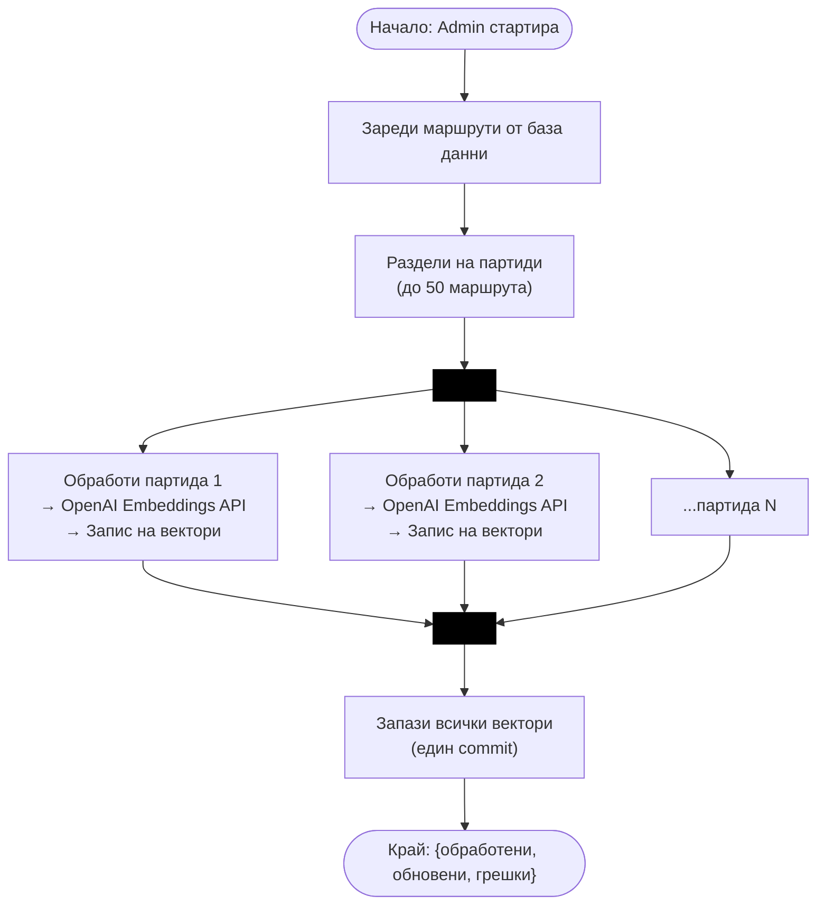

# Активност – Векторно индексиране на маршрути

```mermaid
flowchart TD
    Начало([Начало: Admin стартира]) --> ЗаредиМаршрути["Зареди маршрути от база данни"]
    ЗаредиМаршрути --> РазделиПартиди["Раздели на партиди\n(до 50 маршрута)"]
    РазделиПартиди --> FORK1

    FORK1[ ]:::fork
    FORK1 --> Партида1["Обработи партида 1\n→ OpenAI Embeddings API\n→ Запис на вектори"]
    FORK1 --> Партида2["Обработи партида 2\n→ OpenAI Embeddings API\n→ Запис на вектори"]
    FORK1 --> ПартидаN["...партида N"]

    Партида1 --> JOIN1
    Партида2 --> JOIN1
    ПартидаN --> JOIN1

    JOIN1[ ]:::join
    JOIN1 --> ЗапишиВсичко["Запази всички вектори\n(един commit)"]
    ЗапишиВсичко --> Край(["Край: {обработени, обновени, грешки}"])

    classDef fork fill:#000,stroke:#000
    classDef join fill:#000,stroke:#000
```
