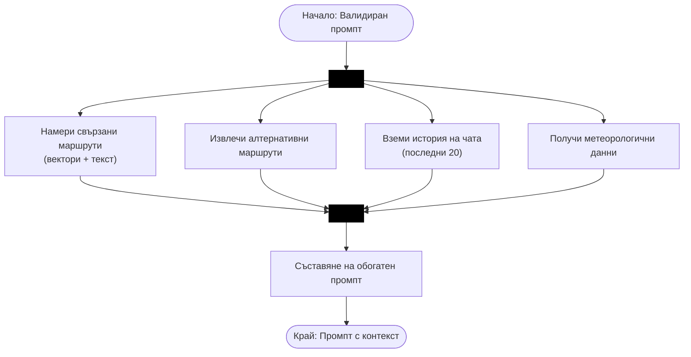

# Активност – Паралелно извличане на AI контекст

```mermaid
flowchart TD
    Начало([Начало: Валидиран промпт]) --> FORK1

    FORK1[ ]:::fork
    FORK1 --> А["Намери свързани маршрути\n(вектори + текст)"]
    FORK1 --> Б["Извлечи алтернативни маршрути"]
    FORK1 --> В["Вземи история на чата\n(последни 20)"]
    FORK1 --> Г["Получи метеорологични данни"]

    А --> JOIN1
    Б --> JOIN1
    В --> JOIN1
    Г --> JOIN1

    JOIN1[ ]:::join
    JOIN1 --> СъставиПромпт["Съставяне на обогатен промпт"]
    СъставиПромпт --> Край([Край: Промпт с контекст])

    classDef fork fill:#000,stroke:#000
    classDef join fill:#000,stroke:#000
```
