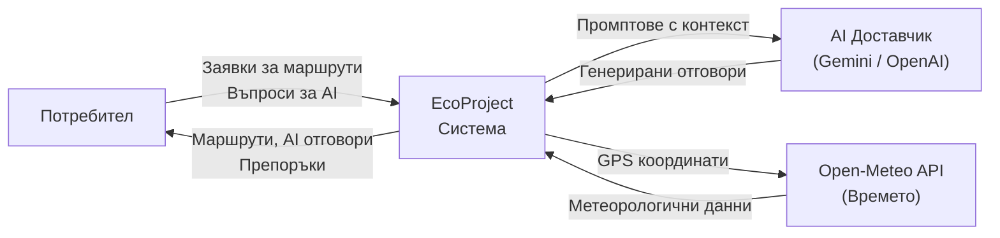

# Диаграма на потоците от данни – Ниво 0: Системен контекст

```mermaid
graph LR
    П["Потребител"]
    С["EcoProject\nСистема"]
    AI["AI Доставчик\n(Gemini / OpenAI)"]
    В["Open-Meteo API\n(Времето)"]

    П -->|"Заявки за маршрути\nВъпроси за AI"| С
    С -->|"Маршрути, AI отговори\nПрепоръки"| П
    С -->|"Промптове с контекст"| AI
    AI -->|"Генерирани отговори"| С
    С -->|"GPS координати"| В
    В -->|"Метеорологични данни"| С
```
