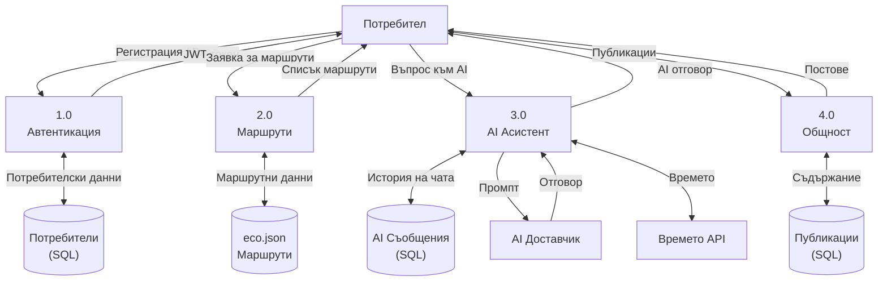

# Диаграма на потоците от данни – Ниво 1: Подсистеми

```mermaid
graph TB
    П["Потребител"]

    П1["1.0\nАвтентикация"]
    П2["2.0\nМаршрути"]
    П3["3.0\nAI Асистент"]
    П4["4.0\nОбщност"]

    Д1[("Потребители\n(SQL)")]
    Д2[("eco.json\nМаршрути")]
    Д3[("AI Съобщения\n(SQL)")]
    Д4[("Публикации\n(SQL)")]

    AI["AI Доставчик"]
    В["Времето API"]

    П -->|"Регистрация / Вход"| П1
    П1 -->|"JWT токен"| П
    П1 <-->|"Потребителски данни"| Д1

    П -->|"Заявка за маршрути"| П2
    П2 -->|"Списък маршрути"| П
    П2 <-->|"Маршрутни данни"| Д2

    П -->|"Въпрос към AI"| П3
    П3 -->|"AI отговор"| П
    П3 <-->|"История на чата"| Д3
    П3 -->|"Промпт"| AI
    AI -->|"Отговор"| П3
    П3 <-->|"Времето"| В

    П -->|"Публикации"| П4
    П4 -->|"Постове"| П
    П4 <-->|"Съдържание"| Д4
```
