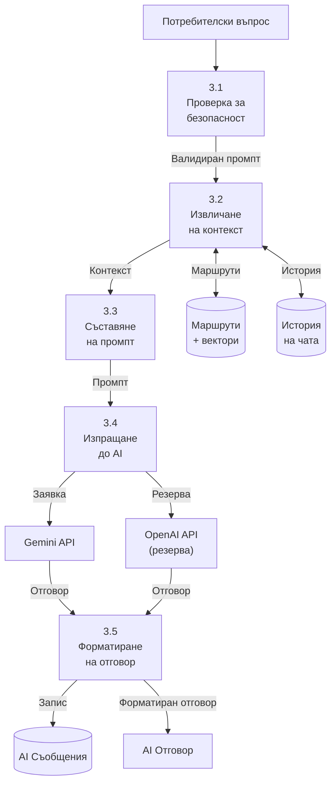

# Диаграма на потоците от данни – Ниво 2: AI Оркестрация

```mermaid
graph TB
    Вход["Потребителски въпрос"]

    П31["3.1\nПроверка за\nбезопасност"]
    П32["3.2\nИзвличане\nна контекст"]
    П33["3.3\nСъставяне\nна промпт"]
    П34["3.4\nИзпращане\nдо AI"]
    П35["3.5\nФорматиране\nна отговор"]

    Д1[("Маршрути\n+ вектори")]
    Д2[("История\nна чата")]
    Д3[("AI Съобщения")]

    Gemini["Gemini API"]
    OpenAI["OpenAI API\n(резерва)"]

    Вход --> П31
    П31 -->|"Валидиран промпт"| П32
    П32 <-->|"Маршрути"| Д1
    П32 <-->|"История"| Д2
    П32 -->|"Контекст"| П33
    П33 -->|"Промпт"| П34
    П34 -->|"Заявка"| Gemini
    П34 -->|"Резерва"| OpenAI
    Gemini -->|"Отговор"| П35
    OpenAI -->|"Отговор"| П35
    П35 -->|"Запис"| Д3
    П35 -->|"Форматиран отговор"| Изход["AI Отговор"]
```
