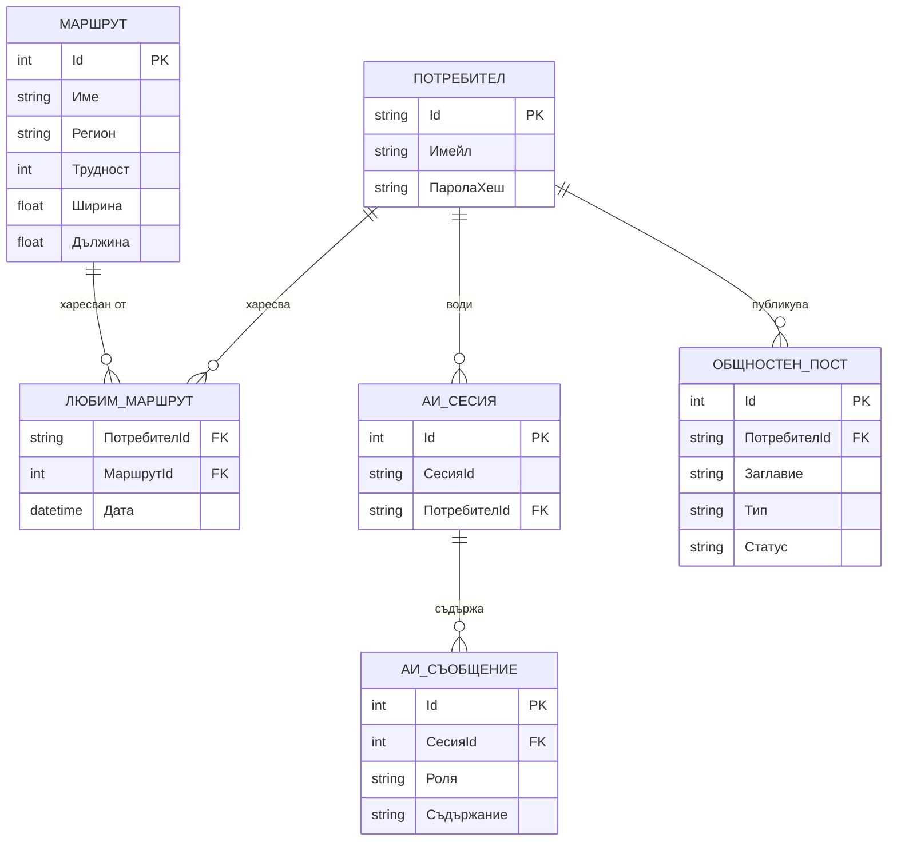

# ER Диаграма – База данни

```mermaid
erDiagram
    ПОТРЕБИТЕЛ {
        string Id PK
        string Имейл
        string ПаролаХеш
    }

    МАРШРУТ {
        int Id PK
        string Име
        string Регион
        int Трудност
        float Ширина
        float Дължина
    }

    ЛЮБИМ_МАРШРУТ {
        string ПотребителId FK
        int МаршрутId FK
        datetime Дата
    }

    АИ_СЕСИЯ {
        int Id PK
        string СесияId
        string ПотребителId FK
    }

    АИ_СЪОБЩЕНИЕ {
        int Id PK
        int СесияId FK
        string Роля
        string Съдържание
    }

    ОБЩНОСТЕН_ПОСТ {
        int Id PK
        string ПотребителId FK
        string Заглавие
        string Тип
        string Статус
    }

    ПОТРЕБИТЕЛ ||--o{ ЛЮБИМ_МАРШРУТ : "харесва"
    МАРШРУТ ||--o{ ЛЮБИМ_МАРШРУТ : "харесван от"
    ПОТРЕБИТЕЛ ||--o{ АИ_СЕСИЯ : "води"
    АИ_СЕСИЯ ||--o{ АИ_СЪОБЩЕНИЕ : "съдържа"
    ПОТРЕБИТЕЛ ||--o{ ОБЩНОСТЕН_ПОСТ : "публикува"
```
