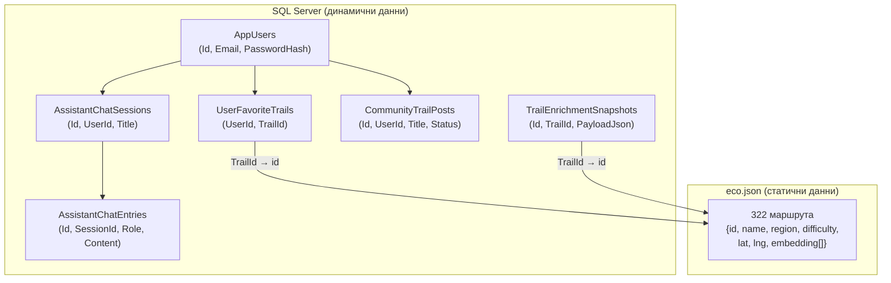

# ER Диаграма – Хибриден модел (SQL + JSON)

```mermaid
graph TB
    subgraph SQL["SQL Server (динамични данни)"]
        ТАБ1["AppUsers\n(Id, Email, PasswordHash)"]
        ТАБ2["UserFavoriteTrails\n(UserId, TrailId)"]
        ТАБ3["AssistantChatSessions\n(Id, UserId, Title)"]
        ТАБ4["AssistantChatEntries\n(Id, SessionId, Role, Content)"]
        ТАБ5["CommunityTrailPosts\n(Id, UserId, Title, Status)"]
        ТАБ6["TrailEnrichmentSnapshots\n(Id, TrailId, PayloadJson)"]
    end

    subgraph JSON["eco.json (статични данни)"]
        ЕКО["322 маршрута\n{id, name, region, difficulty,\nlat, lng, embedding[]}"]
    end

    ТАБ2 -->|"TrailId → id"| ЕКО
    ТАБ6 -->|"TrailId → id"| ЕКО
    ТАБ1 --> ТАБ2
    ТАБ1 --> ТАБ3
    ТАБ3 --> ТАБ4
    ТАБ1 --> ТАБ5
```
