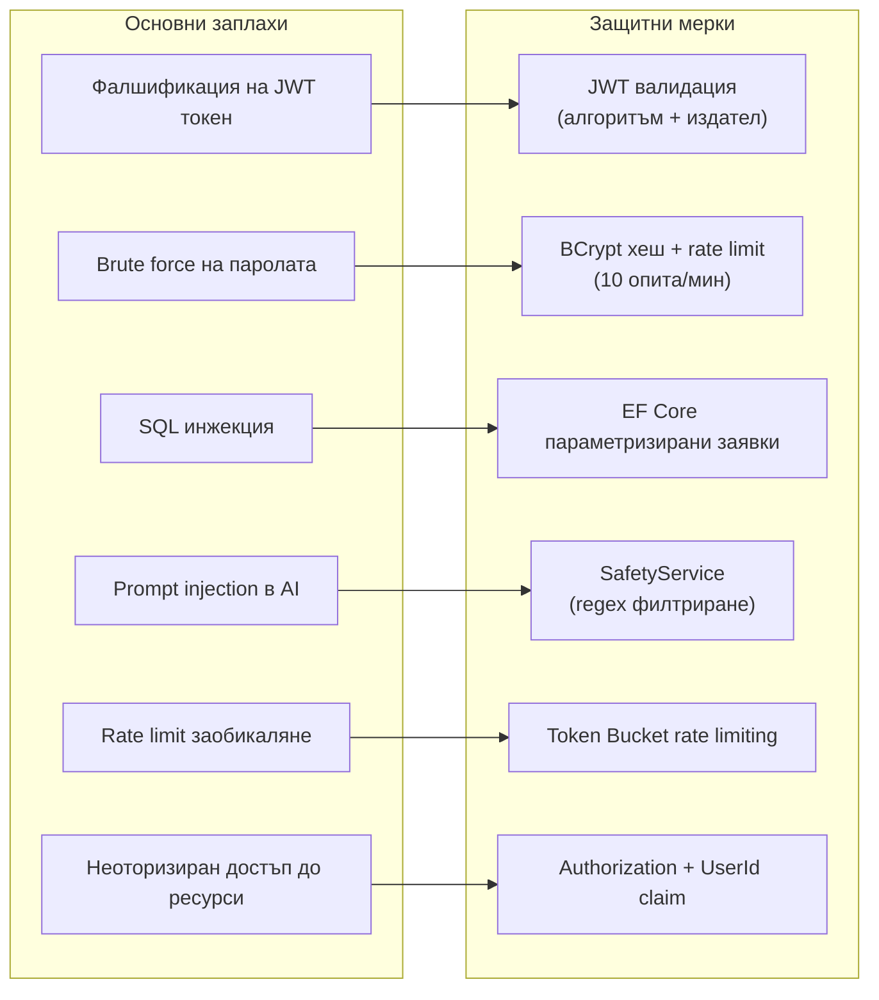

# Моделиране на заплахи – STRIDE

```mermaid
graph LR
    subgraph Заплахи["Основни заплахи"]
        З1["Фалшификация на JWT токен"]
        З2["Brute force на паролата"]
        З3["SQL инжекция"]
        З4["Prompt injection в AI"]
        З5["Rate limit заобикаляне"]
        З6["Неоторизиран достъп до ресурси"]
    end

    subgraph Защити["Защитни мерки"]
        Д1["JWT валидация\n(алгоритъм + издател)"]
        Д2["BCrypt хеш + rate limit\n(10 опита/мин)"]
        Д3["EF Core параметризирани заявки"]
        Д4["SafetyService\n(regex филтриране)"]
        Д5["Token Bucket rate limiting"]
        Д6["Authorization + UserId claim"]
    end

    З1 --> Д1
    З2 --> Д2
    З3 --> Д3
    З4 --> Д4
    З5 --> Д5
    З6 --> Д6
```
