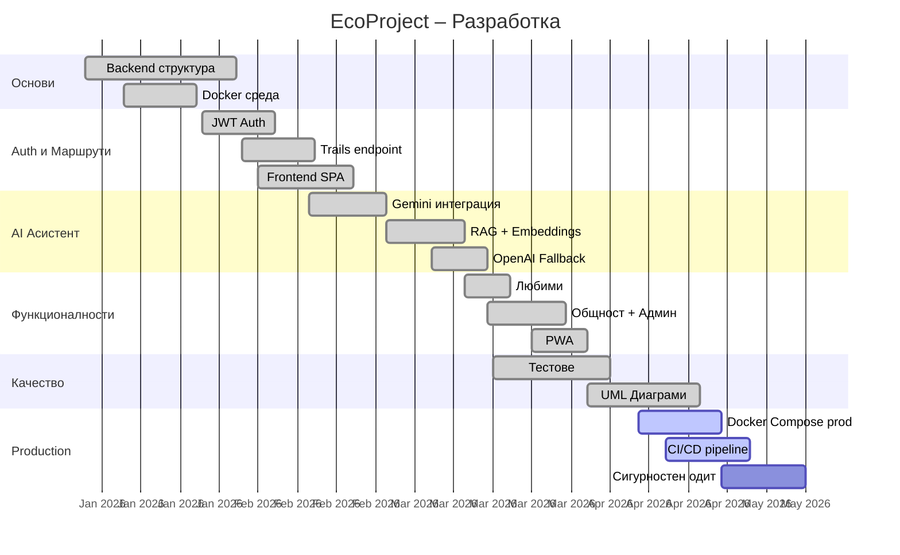

# Календарен график – Gantt Chart

```mermaid
gantt
    title EcoProject – Разработка
    dateFormat  YYYY-MM-DD
    axisFormat  %b %Y

    section Основи
    Backend структура     :done, 2026-01-01, 2026-01-28
    Docker среда          :done, 2026-01-08, 2026-01-21

    section Auth и Маршрути
    JWT Auth              :done, 2026-01-22, 2026-02-04
    Trails endpoint       :done, 2026-01-29, 2026-02-11
    Frontend SPA          :done, 2026-02-01, 2026-02-18

    section AI Асистент
    Gemini интеграция     :done, 2026-02-10, 2026-02-24
    RAG + Embeddings      :done, 2026-02-24, 2026-03-10
    OpenAI Fallback       :done, 2026-03-04, 2026-03-14

    section Функционалности
    Любими                :done, 2026-03-10, 2026-03-18
    Общност + Админ       :done, 2026-03-14, 2026-03-28
    PWA                   :done, 2026-03-22, 2026-04-01

    section Качество
    Тестове               :done, 2026-03-15, 2026-04-05
    UML Диаграми          :done, 2026-04-01, 2026-04-21

    section Production
    Docker Compose prod   :active, 2026-04-10, 2026-04-25
    CI/CD pipeline        :active, 2026-04-15, 2026-04-30
    Сигурностен одит      :2026-04-25, 2026-05-10
```
