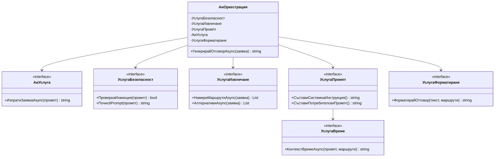

# Диаграма на класовете – AI Интерфейси

```mermaid
classDiagram
    class АиУслуга {
        <<interface>>
        +ИзпратиЗаявкаAsync(промпт) string
    }

    class УслугаБезопасност {
        <<interface>>
        +ПроверкаИнжекция(промпт) bool
        +ПочисtiPrompt(промпт) string
    }

    class УслугаИзвличане {
        <<interface>>
        +НамериМаршрутиAsync(заявка) List
        +АлтернативиAsync(заявка) List
    }

    class УслугаПромпт {
        <<interface>>
        +СъставиСистемнаИнструкция() string
        +СъставиПотребителскиПромпт() string
    }

    class УслугаФорматиране {
        <<interface>>
        +ФорматирайОтговор(текст, маршрути) string
    }

    class УслугаВреме {
        <<interface>>
        +КонтекстВремеAsync(промпт, маршрути) string
    }

    class АиОркестрация {
        -УслугаБезопасност
        -УслугаИзвличане
        -УслугаПромпт
        -АиУслуга
        -УслугаФорматиране
        +ГенерирайОтговорAsync(заявка) string
    }

    АиОркестрация --> УслугаБезопасност
    АиОркестрация --> УслугаИзвличане
    АиОркестрация --> УслугаПромпт
    АиОркестрация --> АиУслуга
    АиОркестрация --> УслугаФорматиране
    УслугаПромпт --> УслугаВреме
```
