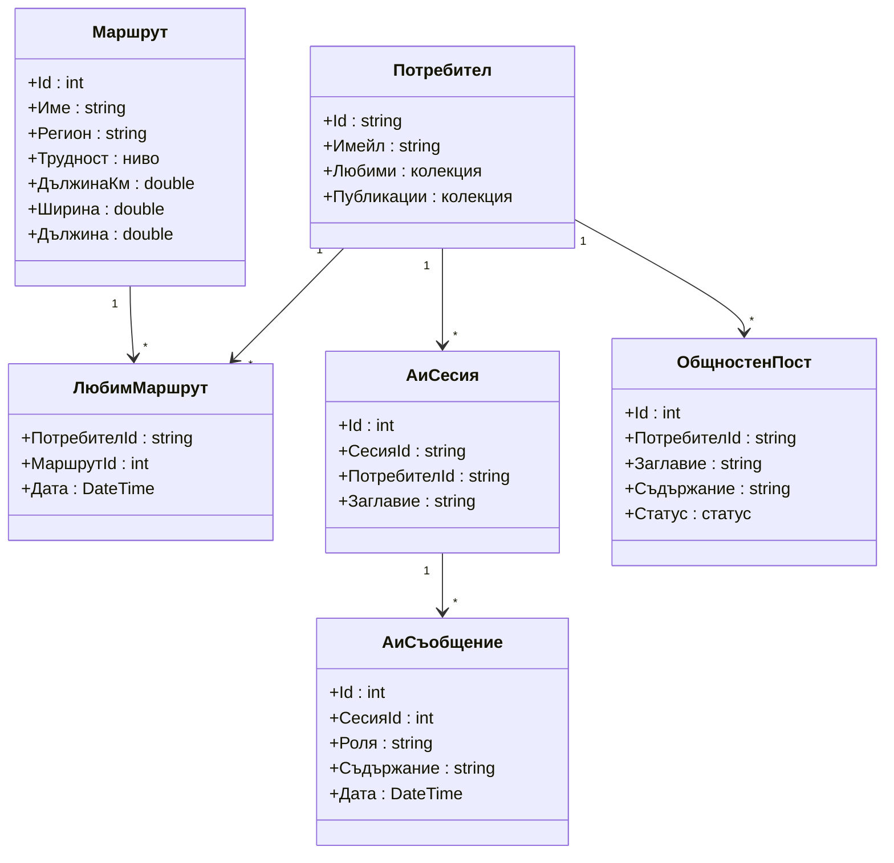

# Диаграма на класовете – Домейн модел

```mermaid
classDiagram
    class Потребител {
        +Id : string
        +Имейл : string
        +Любими : колекция
        +Публикации : колекция
    }

    class Маршрут {
        +Id : int
        +Име : string
        +Регион : string
        +Трудност : ниво
        +ДължинаКм : double
        +Ширина : double
        +Дължина : double
    }

    class ЛюбимМаршрут {
        +ПотребителId : string
        +МаршрутId : int
        +Дата : DateTime
    }

    class АиСесия {
        +Id : int
        +СесияId : string
        +ПотребителId : string
        +Заглавие : string
    }

    class АиСъобщение {
        +Id : int
        +СесияId : int
        +Роля : string
        +Съдържание : string
        +Дата : DateTime
    }

    class ОбщностенПост {
        +Id : int
        +ПотребителId : string
        +Заглавие : string
        +Съдържание : string
        +Статус : статус
    }

    Потребител "1" --> "*" ЛюбимМаршрут
    Маршрут "1" --> "*" ЛюбимМаршрут
    Потребител "1" --> "*" АиСесия
    АиСесия "1" --> "*" АиСъобщение
    Потребител "1" --> "*" ОбщностенПост
```
