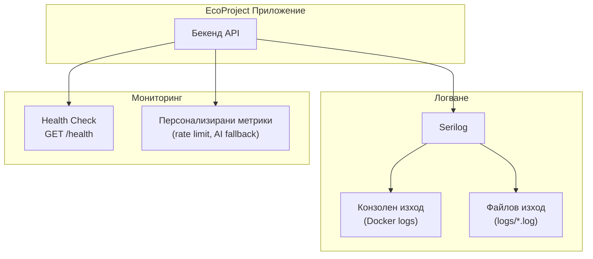

# Архитектура на наблюдаемостта

```mermaid
graph TB
    subgraph Приложение["EcoProject Приложение"]
        А["Бекенд API"]
    end

    subgraph Логване["Логване"]
        Serilog["Serilog"]
        Конзола["Конзолен изход\n(Docker logs)"]
        Файл["Файлов изход\n(logs/*.log)"]
    end

    subgraph Мониторинг["Мониторинг"]
        Здраве["Health Check\nGET /health"]
        Метрики["Персонализирани метрики\n(rate limit, AI fallback)"]
    end

    А --> Serilog
    Serilog --> Конзола
    Serilog --> Файл
    А --> Здраве
    А --> Метрики
```
