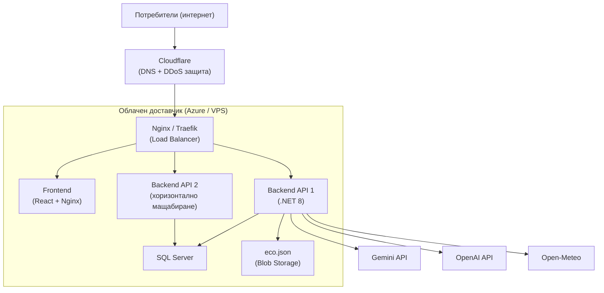

# Облачна архитектура

```mermaid
graph TB
    Потребители["Потребители (интернет)"]
    CDN["Cloudflare\n(DNS + DDoS защита)"]

    subgraph Облак["Облачен доставчик (Azure / VPS)"]
        LB["Nginx / Traefik\n(Load Balancer)"]
        Ф["Frontend\n(React + Nginx)"]
        Б1["Backend API 1\n(.NET 8)"]
        Б2["Backend API 2\n(хоризонтално мащабиране)"]
        БД["SQL Server"]
        Файлове["eco.json\n(Blob Storage)"]
    end

    Gemini["Gemini API"]
    OpenAI["OpenAI API"]
    Времето["Open-Meteo"]

    Потребители --> CDN
    CDN --> LB
    LB --> Ф
    LB --> Б1
    LB --> Б2
    Б1 --> БД
    Б2 --> БД
    Б1 --> Файлове
    Б1 --> Gemini
    Б1 --> OpenAI
    Б1 --> Времето
```
