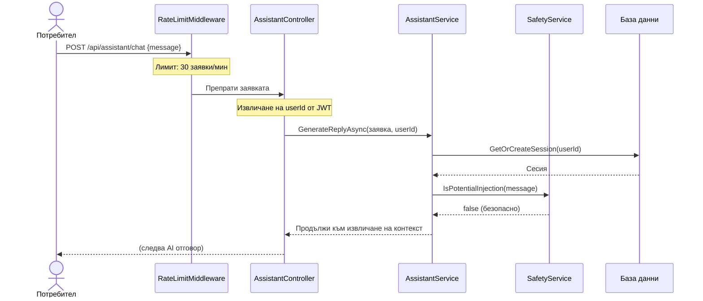

# Последователност – AI Чат: Проверка за безопасност

```mermaid
sequenceDiagram
    actor П as Потребител
    participant О as RateLimitMiddleware
    participant К as AssistantController
    participant У as AssistantService
    participant Б as SafetyService
    participant БД as База данни

    П->>О: POST /api/assistant/chat {message}
    Note over О: Лимит: 30 заявки/мин
    О->>К: Препрати заявката
    Note over К: Извличане на userId от JWT
    К->>У: GenerateReplyAsync(заявка, userId)
    У->>БД: GetOrCreateSession(userId)
    БД-->>У: Сесия
    У->>Б: IsPotentialInjection(message)
    Б-->>У: false (безопасно)
    У-->>К: Продължи към извличане на контекст
    К-->>П: (следва AI отговор)
```
