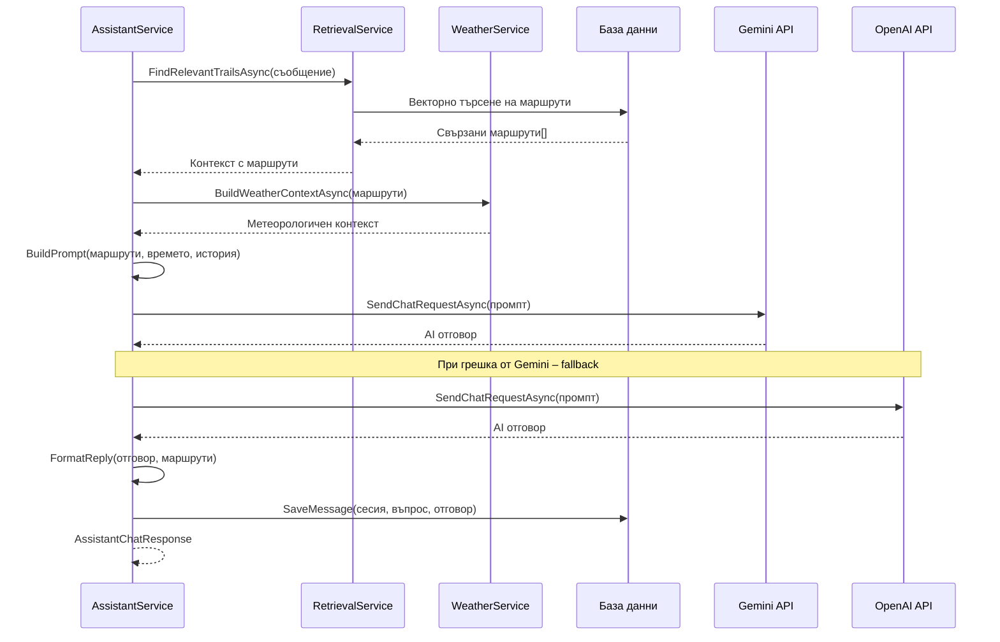

# Последователност – AI Чат: Извличане на контекст и отговор

```mermaid
sequenceDiagram
    participant У as AssistantService
    participant ИУ as RetrievalService
    participant ВУ as WeatherService
    participant БД as База данни
    participant AI as Gemini API
    participant AI2 as OpenAI API

    У->>ИУ: FindRelevantTrailsAsync(съобщение)
    ИУ->>БД: Векторно търсене на маршрути
    БД-->>ИУ: Свързани маршрути[]
    ИУ-->>У: Контекст с маршрути

    У->>ВУ: BuildWeatherContextAsync(маршрути)
    ВУ-->>У: Метеорологичен контекст

    У->>У: BuildPrompt(маршрути, времето, история)
    У->>AI: SendChatRequestAsync(промпт)
    AI-->>У: AI отговор
    Note over У,AI2: При грешка от Gemini – fallback
    У->>AI2: SendChatRequestAsync(промпт)
    AI2-->>У: AI отговор

    У->>У: FormatReply(отговор, маршрути)
    У->>БД: SaveMessage(сесия, въпрос, отговор)
    У-->>У: AssistantChatResponse
```
