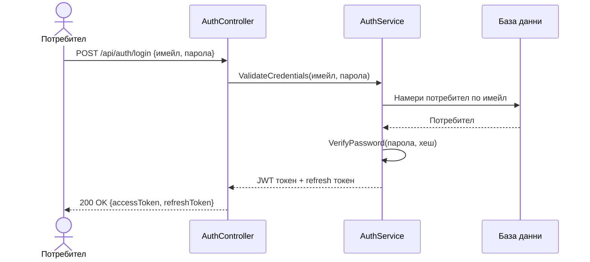

# Последователност – Вход в системата

```mermaid
sequenceDiagram
    actor П as Потребител
    participant К as AuthController
    participant У as AuthService
    participant БД as База данни

    П->>К: POST /api/auth/login {имейл, парола}
    К->>У: ValidateCredentials(имейл, парола)
    У->>БД: Намери потребител по имейл
    БД-->>У: Потребител
    У->>У: VerifyPassword(парола, хеш)
    У-->>К: JWT токен + refresh токен
    К-->>П: 200 OK {accessToken, refreshToken}
```
