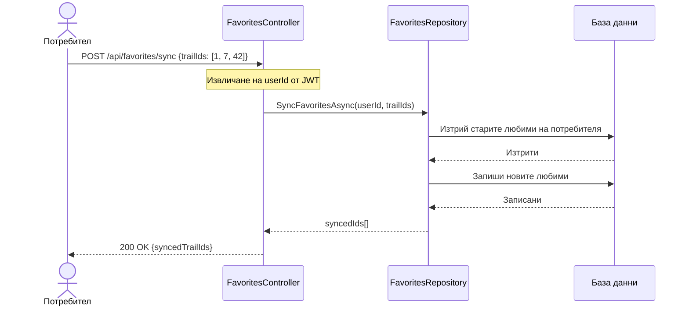

# Последователност – Синхронизация на любими маршрути

```mermaid
sequenceDiagram
    actor П as Потребител
    participant К as FavoritesController
    participant Х as FavoritesRepository
    participant БД as База данни

    П->>К: POST /api/favorites/sync {trailIds: [1, 7, 42]}
    Note over К: Извличане на userId от JWT
    К->>Х: SyncFavoritesAsync(userId, trailIds)
    Х->>БД: Изтрий старите любими на потребителя
    БД-->>Х: Изтрити
    Х->>БД: Запиши новите любими
    БД-->>Х: Записани
    Х-->>К: syncedIds[]
    К-->>П: 200 OK {syncedTrailIds}
```
