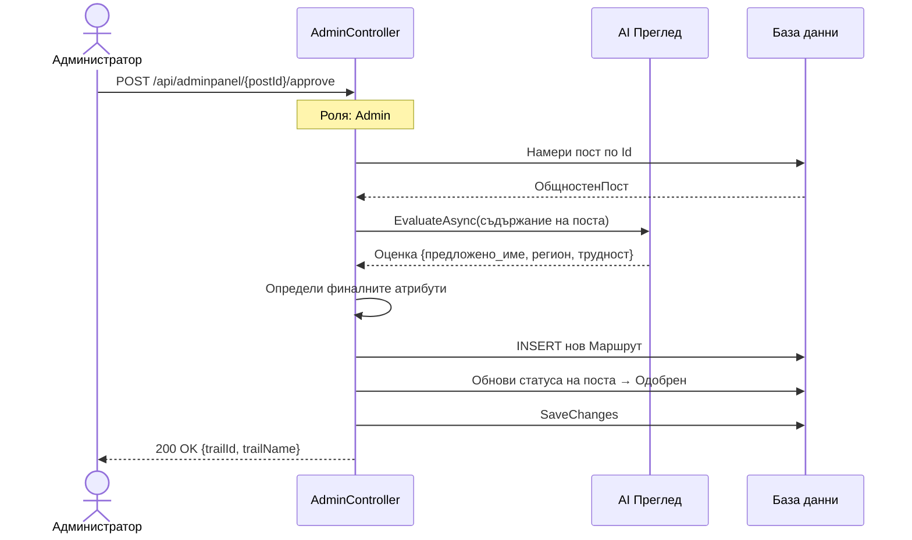

# Последователност – Одобряване на предложение за маршрут

```mermaid
sequenceDiagram
    actor А as Администратор
    participant К as AdminController
    participant AI as AI Преглед
    participant БД as База данни

    А->>К: POST /api/adminpanel/{postId}/approve
    Note over К: Роля: Admin
    К->>БД: Намери пост по Id
    БД-->>К: ОбщностенПост
    К->>AI: EvaluateAsync(съдържание на поста)
    AI-->>К: Оценка {предложено_име, регион, трудност}
    К->>К: Определи финалните атрибути
    К->>БД: INSERT нов Маршрут
    К->>БД: Обнови статуса на поста → Одобрен
    К->>БД: SaveChanges
    К-->>А: 200 OK {trailId, trailName}
```
