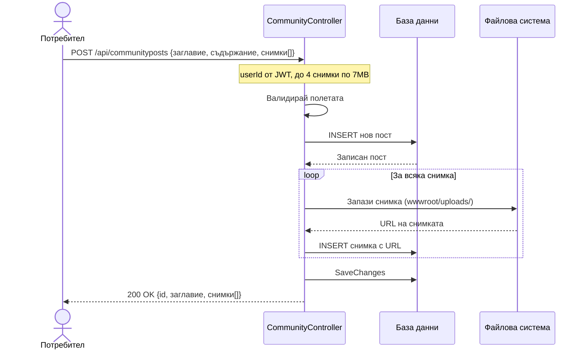

# Последователност – Публикация в общността

```mermaid
sequenceDiagram
    actor П as Потребител
    participant К as CommunityController
    participant БД as База данни
    participant ФС as Файлова система

    П->>К: POST /api/communityposts {заглавие, съдържание, снимки[]}
    Note over К: userId от JWT, до 4 снимки по 7MB
    К->>К: Валидирай полетата
    К->>БД: INSERT нов пост
    БД-->>К: Записан пост
    loop За всяка снимка
        К->>ФС: Запази снимка (wwwroot/uploads/)
        ФС-->>К: URL на снимката
        К->>БД: INSERT снимка с URL
    end
    К->>БД: SaveChanges
    К-->>П: 200 OK {id, заглавие, снимки[]}
```
