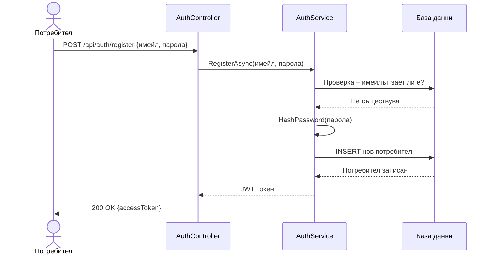

# Последователност – Регистрация

```mermaid
sequenceDiagram
    actor П as Потребител
    participant К as AuthController
    participant У as AuthService
    participant БД as База данни

    П->>К: POST /api/auth/register {имейл, парола}
    К->>У: RegisterAsync(имейл, парола)
    У->>БД: Проверка – имейлът зает ли е?
    БД-->>У: Не съществува
    У->>У: HashPassword(парола)
    У->>БД: INSERT нов потребител
    БД-->>У: Потребител записан
    У-->>К: JWT токен
    К-->>П: 200 OK {accessToken}
```
