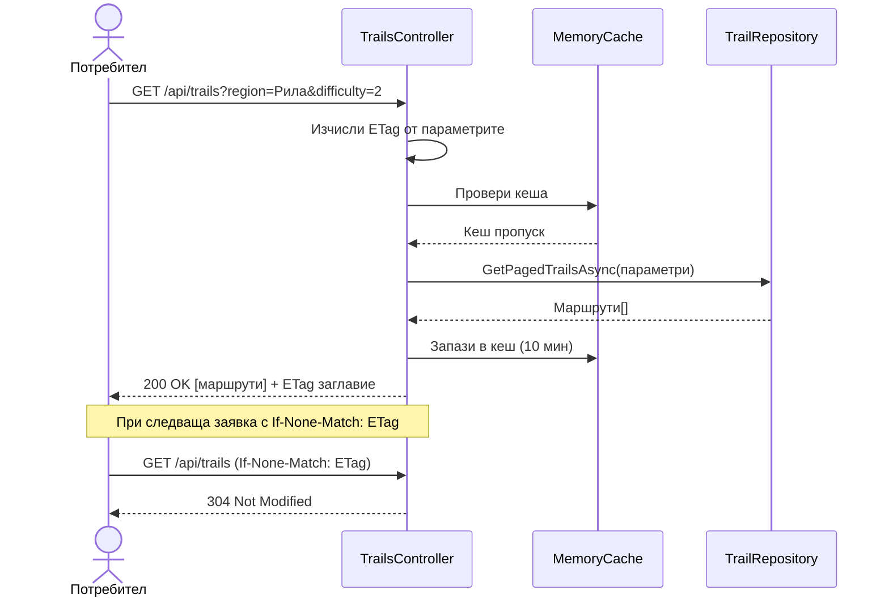

# Последователност – Търсене на маршрути с ETag кеш

```mermaid
sequenceDiagram
    actor П as Потребител
    participant К as TrailsController
    participant К2 as MemoryCache
    participant Х as TrailRepository

    П->>К: GET /api/trails?region=Рила&difficulty=2
    К->>К: Изчисли ETag от параметрите
    К->>К2: Провери кеша
    К2-->>К: Кеш пропуск
    К->>Х: GetPagedTrailsAsync(параметри)
    Х-->>К: Маршрути[]
    К->>К2: Запази в кеш (10 мин)
    К-->>П: 200 OK [маршрути] + ETag заглавие
    Note over П,К: При следваща заявка с If-None-Match: ETag
    П->>К: GET /api/trails (If-None-Match: ETag)
    К-->>П: 304 Not Modified
```
