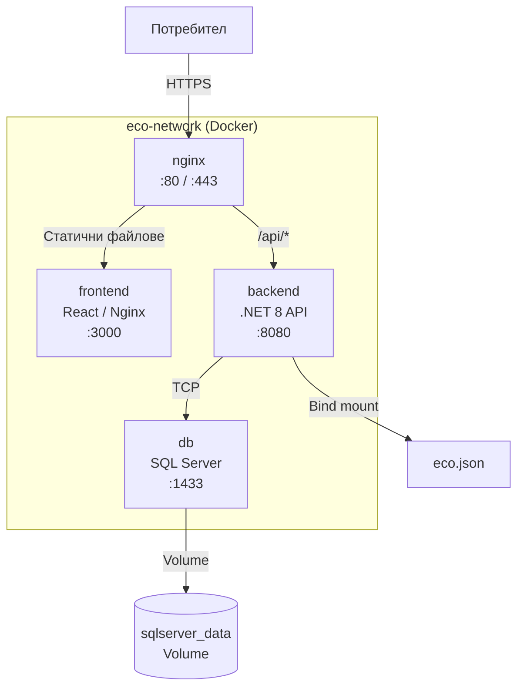

# Диаграма на разгръщането – Docker Compose

```mermaid
graph TB
    subgraph DockerNetwork["eco-network (Docker)"]
        Nginx["nginx\n:80 / :443"]
        Фронтенд["frontend\nReact / Nginx\n:3000"]
        Бекенд["backend\n.NET 8 API\n:8080"]
        БД["db\nSQL Server\n:1433"]
    end

    Потребител["Потребител"] -->|"HTTPS"| Nginx
    Nginx -->|"Статични файлове"| Фронтенд
    Nginx -->|"/api/*"| Бекенд
    Бекенд -->|"TCP"| БД
    Бекенд -->|"Bind mount"| EcoJson["eco.json"]
    БД -->|"Volume"| ТомSQL[("sqlserver_data\nVolume")]
```
