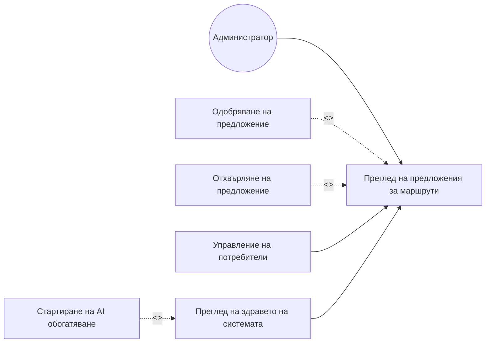

# Случаи на употреба – Администратор

```mermaid
graph LR
    Администратор(("Администратор"))

    UC1["Преглед на предложения за маршрути"]
    UC2["Одобряване на предложение"]
    UC3["Отхвърляне на предложение"]
    UC4["Управление на потребители"]
    UC5["Преглед на здравето на системата"]
    UC6["Стартиране на AI обогатяване"]

    Администратор --> UC1

    UC2 -.->|"<<include>>"| UC1
    UC3 -.->|"<<extend>>"| UC1
    UC4 --> UC1
    UC5 --> UC1
    UC6 -.->|"<<extend>>"| UC5
```
