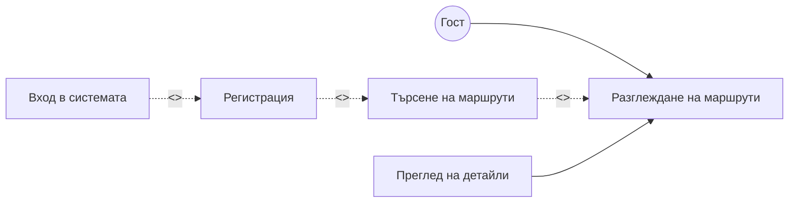

# Случаи на употреба – Гост

```mermaid
graph LR
    Гост(("Гост"))

    UC1["Разглеждане на маршрути"]
    UC2["Търсене на маршрути"]
    UC3["Регистрация"]
    UC4["Преглед на детайли"]
    UC5["Вход в системата"]

    Гост --> UC1

    UC2 -.->|"<<include>>"| UC1
    UC3 -.->|"<<extend>>"| UC2
    UC4 --> UC1
    UC5 -.->|"<<extend>>"| UC3
```