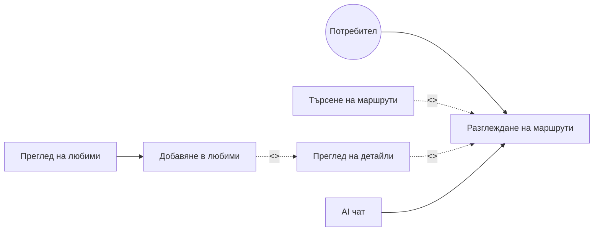

# Случаи на употреба – Потребител

```mermaid
graph LR
    Потребител(("Потребител"))

    UC1["Разглеждане на маршрути"]
    UC2["Търсене на маршрути"]
    UC3["Преглед на детайли"]
    UC4["Добавяне в любими"]
    UC5["AI чат"]
    UC6["Преглед на любими"]

    Потребител --> UC1
    
    UC2 -.->|"<<include>>"| UC1
    UC3 -.->|"<<extend>>"| UC1
    UC4 -.->|"<<extend>>"| UC3
    UC5 --> UC1
    UC6 --> UC4
```
