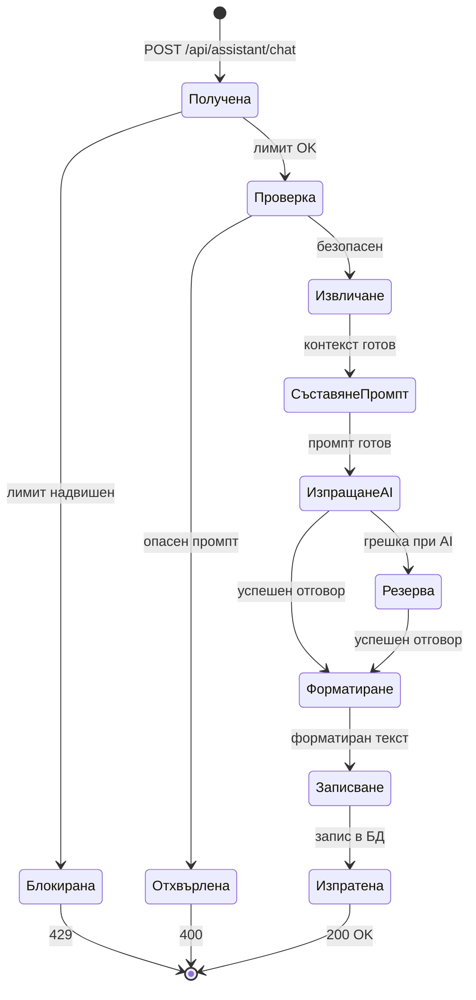

# Диаграма на състоянията – Жизнен цикъл на AI заявка

```mermaid
stateDiagram-v2
    [*] --> Получена : POST /api/assistant/chat

    Получена --> Блокирана : лимит надвишен
    Получена --> Проверка : лимит OK

    Блокирана --> [*] : 429

    Проверка --> Отхвърлена : опасен промпт
    Проверка --> Извличане : безопасен

    Отхвърлена --> [*] : 400

    Извличане --> СъставянеПромпт : контекст готов
    СъставянеПромпт --> ИзпращанеAI : промпт готов

    ИзпращанеAI --> Форматиране : успешен отговор
    ИзпращанеAI --> Резерва : грешка при AI
    Резерва --> Форматиране : успешен отговор

    Форматиране --> Записване : форматиран текст
    Записване --> Изпратена : запис в БД

    Изпратена --> [*] : 200 OK
```
