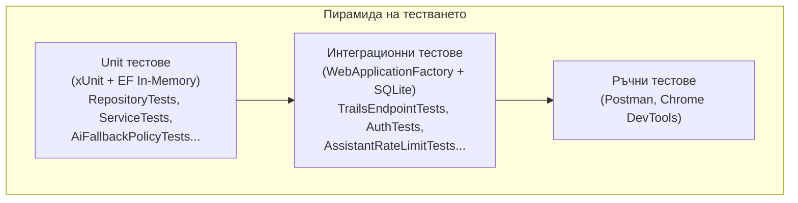

# Стратегия за тестване – Пирамида

```mermaid
graph TB
    subgraph Пирамида["Пирамида на тестването"]
        Е2Е["Ръчни тестове\n(Postman, Chrome DevTools)"]
        Интеграция["Интеграционни тестове\n(WebApplicationFactory + SQLite)\nTrailsEndpointTests, AuthTests,\nAssistantRateLimitTests..."]
        Единични["Unit тестове\n(xUnit + EF In-Memory)\nRepositoryTests, ServiceTests,\nAiFallbackPolicyTests..."]
    end

    Единични --> Интеграция --> Е2Е
```
