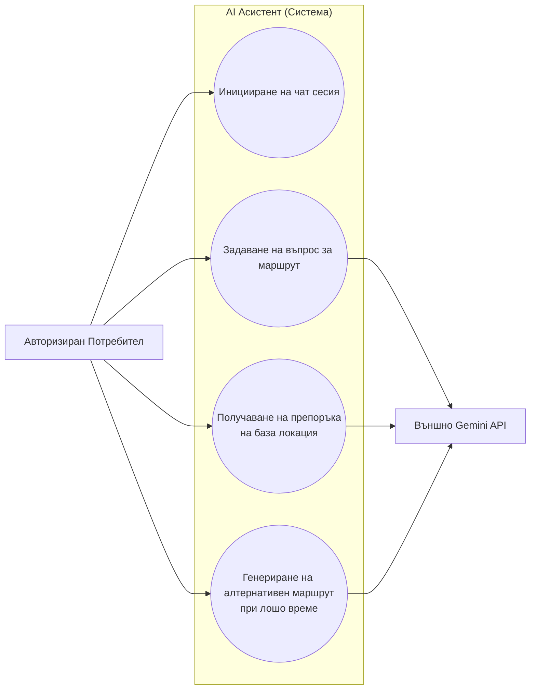

# Фигура 23: Use Case - Взаимодействие с AI подсистемите

Актьори: Авторизиран потребител, AI Асистент (система), външно Gemini API.

```mermaid
flowchart LR
    U["Авторизиран Потребител"]
    G["Външно Gemini API"]

    subgraph AIS["AI Асистент (Система)"]
        UC1(("Иницииране на чат сесия"))
        UC2(("Задаване на въпрос за маршрут"))
        UC3(("Получаване на препоръка\nна база локация"))
        UC4(("Генериране на алтернативен маршрут\nпри лошо време"))
    end

    U --> UC1
    U --> UC2
    U --> UC3
    U --> UC4

    UC2 --> G
    UC3 --> G
    UC4 --> G
```
