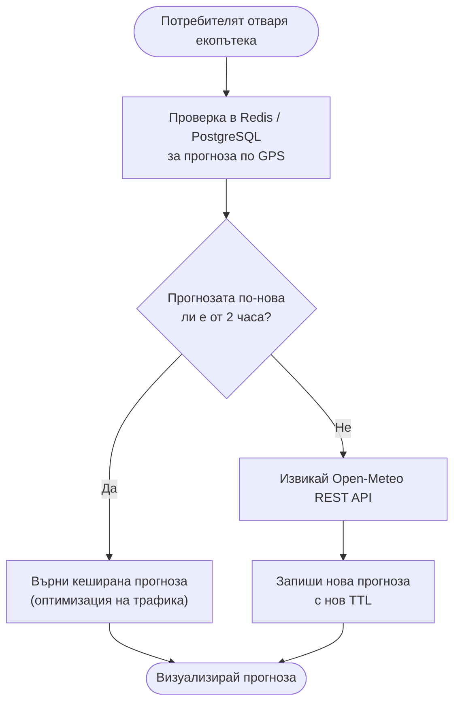

# Фигура 24: Активност - Интеграция с Open-Meteo API и кеширане

Логика с проверка за актуалност на прогнозата (до 2 часа).

```mermaid
flowchart TD
    A(["Потребителят отваря екопътека"])
    B["Проверка в Redis / PostgreSQL\nза прогноза по GPS"]
    C{"Прогнозата по-нова\nли е от 2 часа?"}
    D["Върни кеширана прогноза\n(оптимизация на трафика)"]
    E["Извикай Open-Meteo REST API"]
    F["Запиши нова прогноза\nс нов TTL"]
    G(["Визуализирай прогноза"])

    A --> B --> C
    C -->|"Да"| D --> G
    C -->|"Не"| E --> F --> G
```
