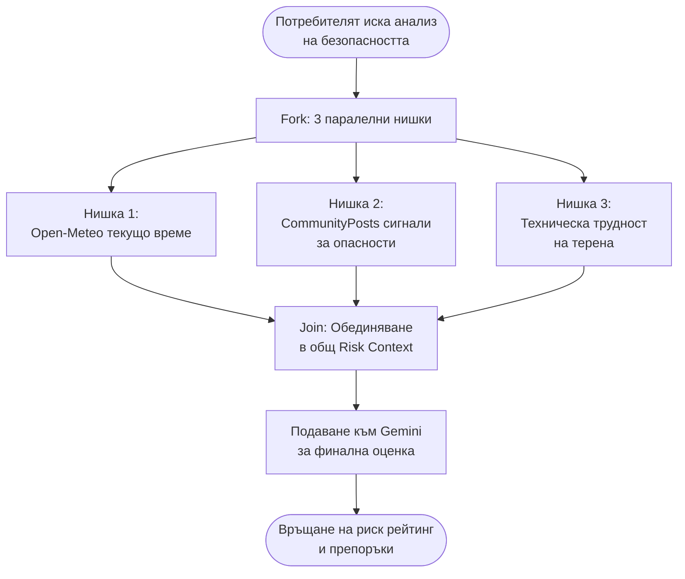

# Фигура 25: Активност - Пълен паралелен поток за оценка на риска (Fork/Join)

При заявка за безопасност потокът се разделя на три асинхронни нишки и се събира в общ контекст.

```mermaid
flowchart TD
    A(["Потребителят иска анализ\nна безопасността"])
    F["Fork: 3 паралелни нишки"]

    B1["Нишка 1:\nOpen-Meteo текущо време"]
    B2["Нишка 2:\nCommunityPosts сигнали\nза опасности"]
    B3["Нишка 3:\nТехническа трудност\nна терена"]

    J["Join: Обединяване\nв общ Risk Context"]
    G["Подаване към Gemini\nза финална оценка"]
    H(["Връщане на риск рейтинг\nи препоръки"])

    A --> F
    F --> B1
    F --> B2
    F --> B3
    B1 --> J
    B2 --> J
    B3 --> J
    J --> G --> H
```
