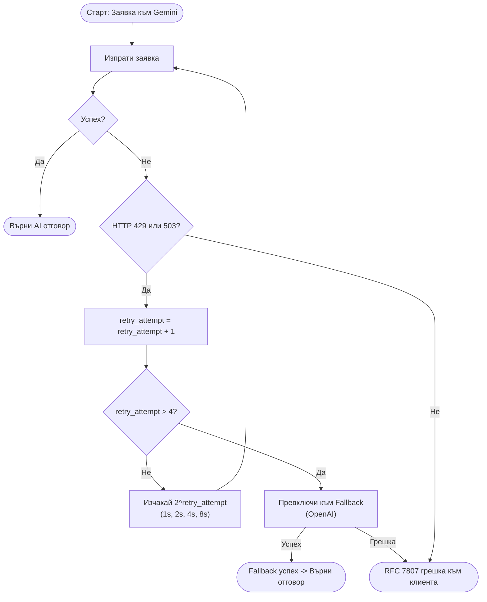

# Фигура 26: Активност - Retry Policy с експоненциално изчакване

При временни грешки HTTP 429/503 системата повтаря с изчакване по формула $2^{retry\_attempt}$.

```mermaid
flowchart TD
    A(["Старт: Заявка към Gemini"])
    B["Изпрати заявка"]
    C{"Успех?"}
    D(["Върни AI отговор"])
    E{"HTTP 429 или 503?"}
    F["retry_attempt = retry_attempt + 1"]
    G{"retry_attempt > 4?"}
    H["Изчакай 2^retry_attempt\n(1s, 2s, 4s, 8s)"]
    I["Превключи към Fallback\n(OpenAI)"]
    J(["Fallback успех -> Върни отговор"])
    K(["RFC 7807 грешка към клиента"])

    A --> B --> C
    C -->|"Да"| D
    C -->|"Не"| E
    E -->|"Да"| F --> G
    G -->|"Не"| H --> B
    G -->|"Да"| I
    I -->|"Успех"| J
    I -->|"Грешка"| K
    E -->|"Не"| K
```
