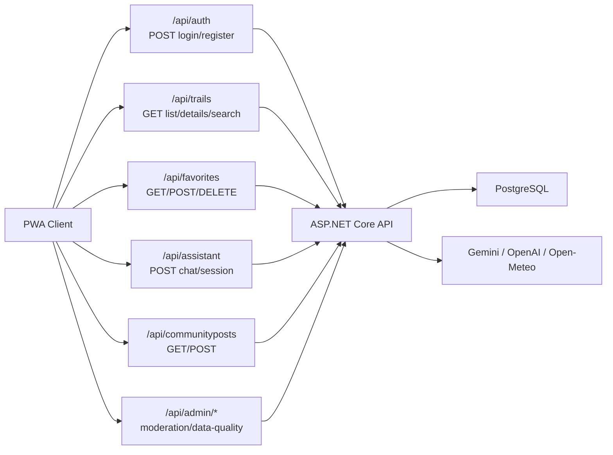

# Фигура 33: API Комуникационна карта (Ендпоинти)

Опростен преглед на ключови API групи и типични HTTP операции.

```mermaid
flowchart LR
    C["PWA Client"] --> AUTH["/api/auth\nPOST login/register"]
    C --> TRAILS["/api/trails\nGET list/details/search"]
    C --> FAV["/api/favorites\nGET/POST/DELETE"]
    C --> AI["/api/assistant\nPOST chat/session"]
    C --> COM["/api/communityposts\nGET/POST"]
    C --> ADM["/api/admin/*\nmoderation/data-quality"]

    AUTH --> API["ASP.NET Core API"]
    TRAILS --> API
    FAV --> API
    AI --> API
    COM --> API
    ADM --> API

    API --> DB["PostgreSQL"]
    API --> EXT["Gemini / OpenAI / Open-Meteo"]
```
