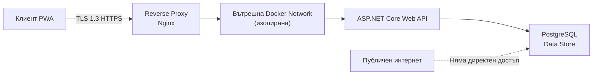

# Фигура 34: Мрежова топология и физическа сигурност

Потокът на заявките и изолиран достъп до базата данни.

```mermaid
flowchart LR
    C["Клиент PWA"] -->|"TLS 1.3 HTTPS"| N["Reverse Proxy\nNginx"]
    N --> D["Вътрешна Docker Network\n(изолирана)"]
    D --> A["ASP.NET Core Web API"]
    A --> P["PostgreSQL\nData Store"]

    X["Публичен интернет"] -. "Няма директен достъп" .-> P
```

Бележка: Базата данни няма публичен IP и е достъпна само от бекенд контейнера.
