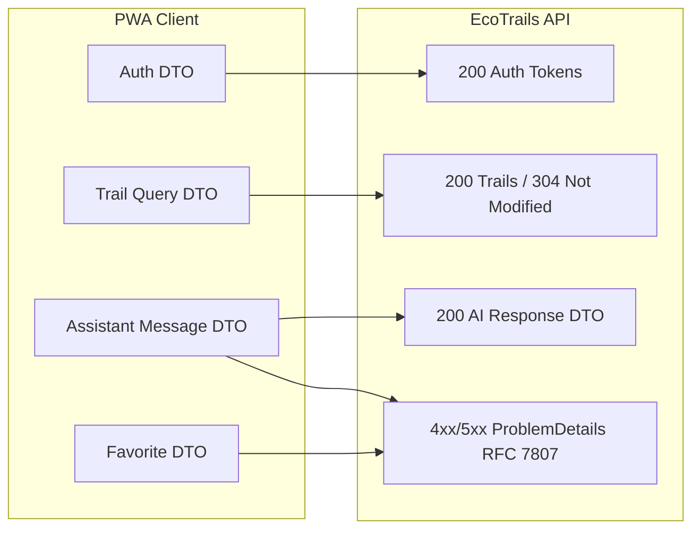

# Фигура 35: Payload Map (JSON DTO договори и RFC 7807)

Комуникационна карта на API формати и пример за стандартна грешка.



Пример за RFC 7807 системна грешка:

```json
{
  "type": "https://ecotrails.bg/errors/ai-provider-unavailable",
  "title": "Service Unavailable",
  "status": 503,
  "detail": "Основната когнитивна услуга (Gemini API) не отговори в рамките на дефинирания timeout. Задействана е fallback политика.",
  "instance": "/api/v1/assistant/session/3f8a/message"
}
```
