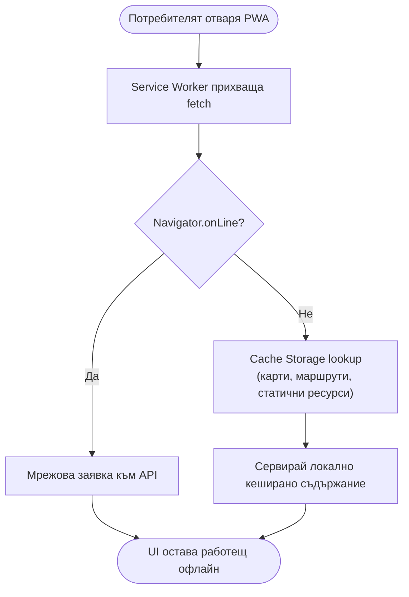

# Фигура 38: Офлайн режим (PWA Service Worker)

Service Worker прихваща fetch и връща кеширани ресурси при липса на мрежа.

```mermaid
flowchart TD
    A(["Потребителят отваря PWA"])
    B["Service Worker прихваща fetch"]
    C{"Navigator.onLine?"}
    D["Мрежова заявка към API"]
    E["Cache Storage lookup\n(карти, маршрути, статични ресурси)"]
    F["Сервирай локално кеширано съдържание"]
    G(["UI остава работещ офлайн"])

    A --> B --> C
    C -->|"Да"| D --> G
    C -->|"Не"| E --> F --> G
```
