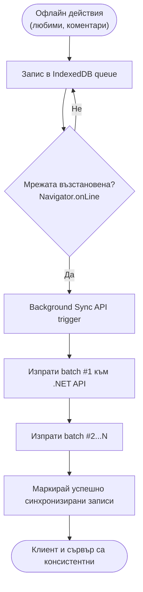

# Фигура 39: Синхронизация след офлайн режим (Background Sync)

Натрупаните офлайн действия в IndexedDB се изпращат автоматично на серии при възстановена мрежа.

```mermaid
flowchart TD
    A(["Офлайн действия\n(любими, коментари)"])
    B["Запис в IndexedDB queue"]
    C{"Мрежата възстановена?\nNavigator.onLine"}
    D["Background Sync API trigger"]
    E["Изпрати batch #1 към .NET API"]
    F["Изпрати batch #2...N"]
    G["Маркирай успешно синхронизирани записи"]
    H(["Клиент и сървър са консистентни"])

    A --> B --> C
    C -->|"Не"| B
    C -->|"Да"| D --> E --> F --> G --> H
```
