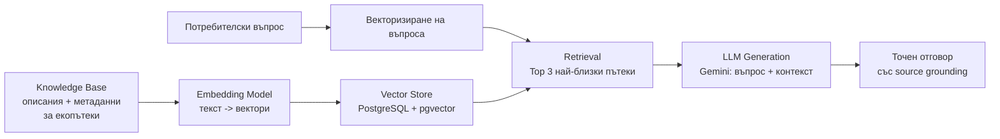

# Фигура 41: Концептуална схема на RAG архитектурата

RAG процес от знание до генерация на отговор с контекст.

```mermaid
flowchart LR
    KB["Knowledge Base\nописания + метаданни\nза екопътеки"] --> EMB["Embedding Model\nтекст -> вектори"]
    EMB --> VS["Vector Store\nPostgreSQL + pgvector"]

    Q["Потребителски въпрос"] --> QE["Векторизиране на въпроса"]
    QE --> RET["Retrieval\nTop 3 най-близки пътеки"]
    VS --> RET

    RET --> LLM["LLM Generation\nGemini: въпрос + контекст"]
    LLM --> ANS["Точен отговор\nсъс source grounding"]
```
