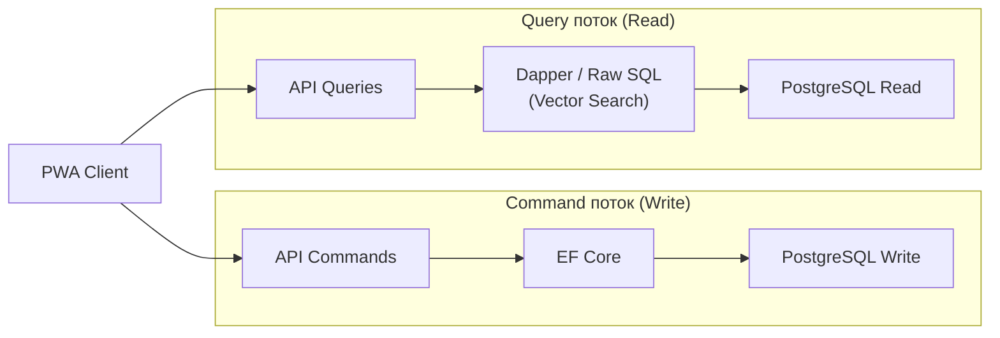

# Фигура 42: Архитектурен модел на CQRS в EcoTrails

Илюстрация на разделението между поток за запис (Commands) и поток за четене (Queries).

```mermaid
flowchart LR
    U["PWA Client"]

    subgraph CMD["Command поток (Write)"]
        C1["API Commands"] --> C2["EF Core"] --> C3["PostgreSQL Write"]
    end

    subgraph QRY["Query поток (Read)"]
        Q1["API Queries"] --> Q2["Dapper / Raw SQL\n(Vector Search)"] --> Q3["PostgreSQL Read"]
    end

    U --> C1
    U --> Q1
```
