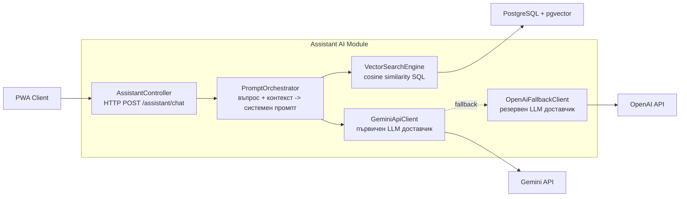

# C4 Модел Ниво 3 (Component) за AI Асистента

Опростен изглед на вътрешните компоненти в контейнера Assistant AI Module.

```mermaid
flowchart LR
    Client["PWA Client"] --> AC["AssistantController\nHTTP POST /assistant/chat"]

    subgraph AIModule["Assistant AI Module"]
        AC --> PO["PromptOrchestrator\nвъпрос + контекст -> системен промпт"]
        PO --> VS["VectorSearchEngine\ncosine similarity SQL"]
        PO --> GA["GeminiApiClient\nпървичен LLM доставчик"]
        GA -. fallback .-> OA["OpenAiFallbackClient\nрезервен LLM доставчик"]
    end

    VS --> DB["PostgreSQL + pgvector"]
    GA --> Gemini["Gemini API"]
    OA --> OpenAI["OpenAI API"]
```
