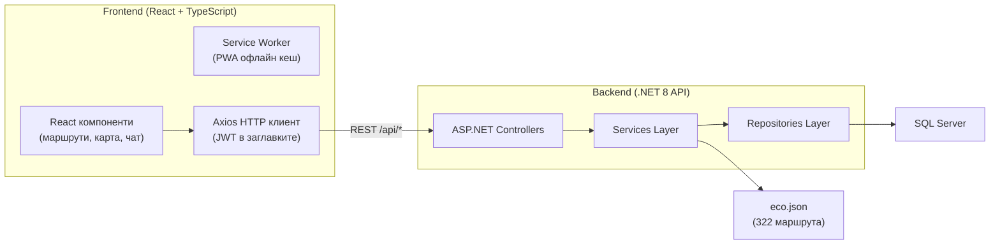

# Фронтенд–Бекенд Архитектура

```mermaid
graph LR
    subgraph Фронтенд["Frontend (React + TypeScript)"]
        Компоненти["React компоненти\n(маршрути, карта, чат)"]
        PWA["Service Worker\n(PWA офлайн кеш)"]
        HTTP["Axios HTTP клиент\n(JWT в заглавките)"]
    end

    subgraph Бекенд["Backend (.NET 8 API)"]
        Контролери["ASP.NET Controllers"]
        Услуги["Services Layer"]
        Хранилища["Repositories Layer"]
    end

    БД["SQL Server"]
    EcoJson["eco.json\n(322 маршрута)"]

    Компоненти --> HTTP
    HTTP -->|"REST /api/*"| Контролери
    Контролери --> Услуги
    Услуги --> Хранилища
    Хранилища --> БД
    Услуги --> EcoJson
```
